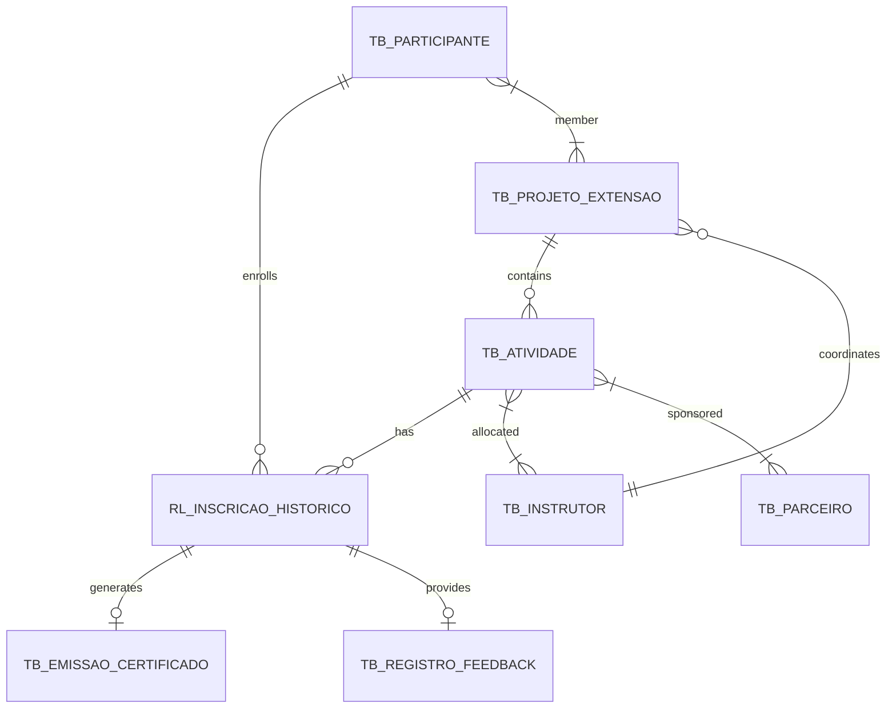

# Conceptual Model: IC Extension Management

This document describes the conceptual model for the IC Extension Management database, following Peter Chen notation.

## 1. Entities and Attributes

- **TB_PROJETO_EXTENSAO** (Project)
  - ID_PROJETO (PK)
  - DS_NOME_PROJETO
  - DT_CRIACAO
  - ID_INSTR_COORDENADOR (FK)

- **TB_ATIVIDADE** (Activity)
  - ID_ATIVIDADE (PK)
  - DS_TITULO_ATIVIDADE
  - DS_CONTEUDO_PROG
  - DT_REALIZACAO
  - ID_PROJ_VINCULADO (FK)

- **TB_PARTICIPANTE** (Participant)
  - ID_PARTICIPANTE (PK)
  - DS_NOME_PARTICIPANTE
  - DS_EMAIL_CONTATO
  - TP_VINCULO_INST

- **TB_INSTRUTOR** (Instructor)
  - ID_INSTRUTOR (PK)
  - DS_NOME_INSTRUTOR
  - DS_ESPECIALIDADE

- **TB_PARCEIRO** (Partner)
  - ID_PARCEIRO (PK)
  - DS_NOME_ORGANIZACAO
  - TP_PARCEIRO

- **TB_EMISSAO_CERTIFICADO** (Certificate)
  - ID_CERTIFICADO (PK)
  - ID_INSCRICAO (FK)
  - DT_EMISSAO
  - CD_AUTENTICIDADE

- **TB_REGISTRO_FEEDBACK** (Feedback)
  - ID_FEEDBACK (PK)
  - ID_INSCRICAO (FK)
  - VL_NOTA_SATISFACAO
  - DS_COMENTARIO_ABERTO

## 2. Relationships

- **RL_INSCRICAO_HISTORICO** (Enrollment)
  - Connects: **TB_PARTICIPANTE** (1) and **TB_ATIVIDADE** (N)
  - Attributes: ID_INSCRICAO (PK), ST_PRESENCA, VL_NOTA_AVALIACAO

- **RL_ALOCACAO_INSTRUTOR** (Allocation)
  - Connects: **TB_ATIVIDADE** (N) and **TB_INSTRUTOR** (N)
  - Attributes: VL_CARGA_HORARIA

- **RL_PATROCINIO_EVENTO** (Sponsorship)
  - Connects: **TB_PARCEIRO** (N) and **TB_ATIVIDADE** (N)
  - Attributes: VL_APORTE

- **RL_MEMBRO_PROJETO** (Membership)
  - Connects: **TB_PARTICIPANTE** (N) and **TB_PROJETO_EXTENSAO** (N)
  - Attributes: TP_PAPEL_ATUACAO

- **COORDENACAO** (Coordination)
  - Connects: **TB_INSTRUTOR** (1) and **TB_PROJETO_EXTENSAO** (N)

- **VINCULO_PROJETO** (Project Link)
  - Connects: **TB_ATIVIDADE** (N) and **TB_PROJETO_EXTENSAO** (1)

- **GERACAO_CERTIFICADO** (Certificate Generation)
  - Connects: **RL_INSCRICAO_HISTORICO** (1) and **TB_EMISSAO_CERTIFICADO** (1)

- **AVALIACAO_FEEDBACK** (Feedback Evaluation)
  - Connects: **RL_INSCRICAO_HISTORICO** (1) and **TB_REGISTRO_FEEDBACK** (1)

## 3. ER Diagram (Mermaid)

